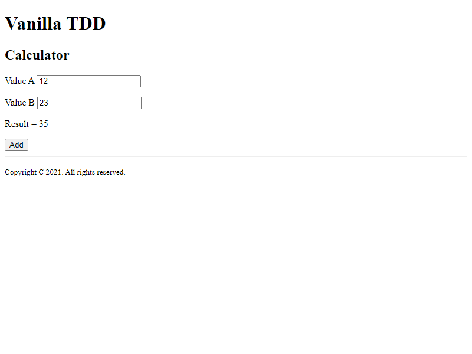

# End to end test with Puppeteer process visualisation
Testing "Adding" calculator function using Jasmine and Puppeteer - task that we made on ALK Frontend Development with React studies.

## How to install:
- install packages with npm install,
- use "npm start" to start the App,
- use "npm run test-1" command to start the test.

## screenshots: 
  
